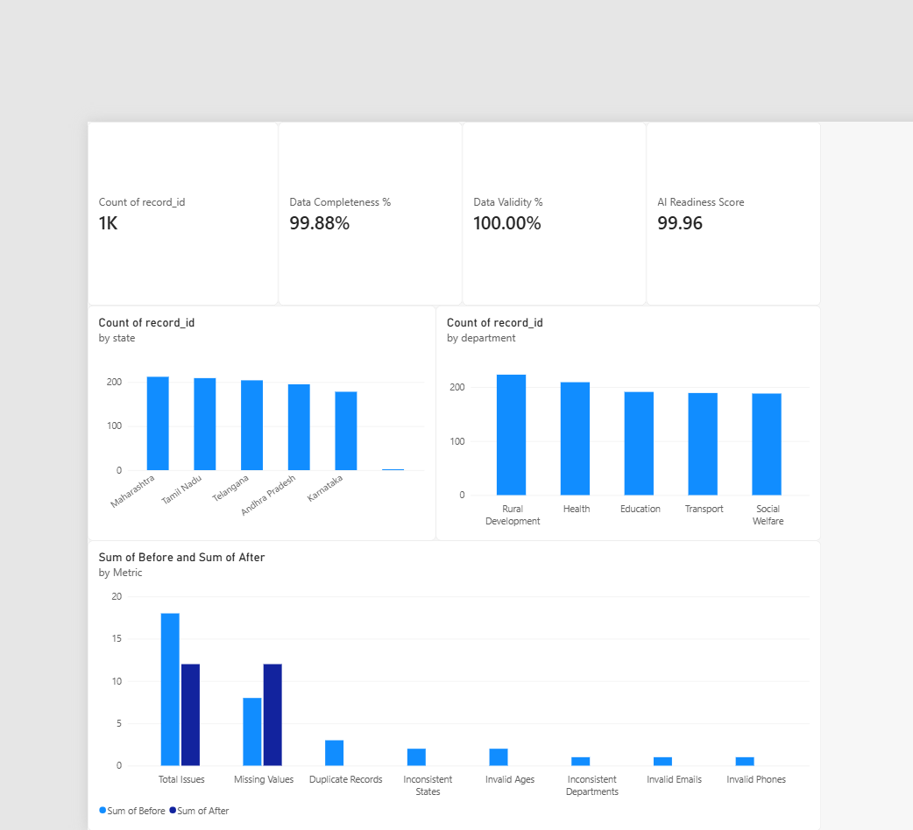

# JanSetu DataTrust

### AI-Assisted Public-Sector Data Quality, Governance & AI Readiness Platform

JanSetu DataTrust is an end-to-end data quality and governance platform demonstrating how messy public-sector datasets can be transformed into reliable, documented, and analysis-ready data assets.

The project combines **Python, SQL, statistical analysis, machine learning, data governance, metadata generation, and Power BI** into a reproducible data workflow.

A synthetic public-service dataset is used throughout the project to demonstrate the complete lifecycle from raw data ingestion to quality assessment, anomaly review, governance documentation, and dashboard reporting.

---

## Overview

Real-world datasets can contain missing values, duplicate records, invalid fields, inconsistent categories, and incomplete metadata.

JanSetu DataTrust addresses these challenges through a structured data-quality pipeline:

```text
Raw Dataset
     ↓
Data Profiling
     ↓
Validation
     ↓
Data Cleaning
     ↓
Quality Assessment
     ↓
SQLite Database
     ↓
SQL Analytics
     ↓
Statistical Analysis
     ↓
Anomaly Detection
     ↓
Data Governance & Lineage
     ↓
AI Readiness Assessment
     ↓
Power BI Dashboard
     ↓
Documented Data Assets
```

The objective is to demonstrate a practical workflow for preparing datasets for **analytics and downstream AI workflows** while maintaining transparency, traceability, and reproducibility.

---

# Key Features

## 1. Automated Data Profiling

The profiling pipeline evaluates:

* Dataset dimensions
* Data types
* Missing values
* Duplicate records
* Unique values
* Field-level statistics
* Data-quality indicators
* Governance-related indicators

## 2. Data Validation & Cleaning

The cleaning pipeline identifies and handles:

* Invalid age values
* Invalid email formats
* Invalid phone numbers
* Inconsistent state names
* Inconsistent department names
* Duplicate records
* Date-format variations

Invalid or inconsistent values are not blindly replaced with fabricated information. Where appropriate, they are converted to missing values and retained for visibility.

## 3. Data Quality Assessment

JanSetu evaluates multiple dimensions of data quality:

* **Completeness**
* **Validity**
* **Consistency**
* **Uniqueness**
* **Schema Readiness**

The project also generates a before-and-after quality comparison to make the impact of data cleaning measurable.

## 4. AI-Assisted Anomaly Detection

An **Isolation Forest** model is used to identify unusual records based on numerical characteristics including:

* Age
* Annual income
* Service-request volume

The model is designed as an **analyst-review mechanism**.

It does not classify records as fraudulent, suspicious citizens, or policy violations.

Flagged records are exported for further human review.

## 5. AI Readiness Assessment

The project contains a transparent, project-defined AI Readiness framework based on:

* Data completeness
* Data validity
* Data consistency
* Uniqueness
* Schema and metadata readiness

The resulting score is an **internal project metric** intended to demonstrate a methodology for evaluating dataset readiness.

It is not an external certification or industry-standard AI-readiness score.

## 6. Data Lineage

The pipeline maintains a machine-readable lineage log covering major processing stages:

* Ingestion
* Cleaning
* Standardization
* Database loading

Each event records processing information such as:

* Pipeline stage
* Input record count
* Output record count
* Records affected
* Transformation context

This provides traceability across the data lifecycle.

## 7. Automated Data Dictionary

JanSetu automatically generates field-level metadata including:

* Column name
* Data type
* Record count
* Missing count
* Missing percentage
* Unique values
* Example values

The generated dictionary is available at:

```text
docs/data_dictionary.csv
```

---

# Dashboard

The project includes a **Power BI dashboard** for monitoring data quality and dataset distribution.

## Dashboard Preview



### Dashboard includes

* Total Records
* Data Completeness
* Data Validity
* Data Consistency
* AI Readiness Score
* Before vs. After Quality Comparison
* State Distribution
* Department Distribution

The Power BI report is included in the repository:

```text
JanSetu_DataTrust.pbix
```

---

# Key Results

The current synthetic dataset contains:

| Metric                       |      Result |
| ---------------------------- | ----------: |
| Raw Records                  |       1,003 |
| Clean Records                |       1,000 |
| Duplicate Records Removed    |           3 |
| Initial Quality Issues       |          18 |
| Remaining Flagged Issues     |          12 |
| Data Completeness            |      99.88% |
| Data Validity                |     100.00% |
| Data Consistency             |      99.90% |
| Project-Defined AI Readiness | 99.96 / 100 |
| Anomaly Records Flagged      |          50 |

## Before vs. After Quality Assessment

| Quality Metric           | Before | After |
| ------------------------ | -----: | ----: |
| Total Issues             |     18 |    12 |
| Duplicate Records        |      3 |     0 |
| Invalid Ages             |      2 |     0 |
| Invalid Emails           |      1 |     0 |
| Invalid Phones           |      1 |     0 |
| Inconsistent States      |      2 |     0 |
| Inconsistent Departments |      1 |     0 |
| Missing Values           |      8 |    12 |

The increase in missing values is intentional. Invalid or inconsistent values are preserved as missing rather than being replaced with fabricated information.

---

# Technology Stack

### Programming & Data

* Python
* Pandas
* NumPy
* Scikit-learn
* SQLite
* SQL

### Analytics & Visualization

* Microsoft Power BI
* Microsoft Excel

### Machine Learning

* Isolation Forest
* Statistical analysis
* Numerical anomaly detection

### Engineering & Documentation

* Git
* GitHub
* CSV
* JSONL
* HTML
* Data lineage
* Data dictionary

---

# Project Structure

```text
JanSetu-DataTrust/
│
├── data/
│   ├── raw/
│   │   └── public_service_records.csv
│   │
│   ├── processed/
│   │   ├── cleaned_public_service_records.csv
│   │   └── anomaly_review.csv
│   │
│   └── jansetu.db
│
├── src/
│   ├── config.py
│   ├── generate_data.py
│   ├── profile_data.py
│   ├── clean_data.py
│   ├── load_database.py
│   ├── run_sql.py
│   ├── statistics.py
│   ├── anomaly_detection.py
│   ├── readiness_score.py
│   ├── quality_report.py
│   ├── lineage.py
│   └── data_dictionary.py
│
├── sql/
│   └── analytics.sql
│
├── docs/
│   ├── data_dictionary.csv
│   ├── data_lineage.jsonl
│   └── jansetu_dashboard.png
│
├── SchemaSense/
│   ├── app.py
│   ├── sample_data.csv
│   ├── schema_profile.csv
│   ├── data_dictionary.csv
│   └── schemasense_report.html
│
├── reports/
├── dashboard/
│
├── JanSetu_DataTrust.pbix
├── .gitignore
└── README.md
```

---

# Reproducible Workflow

The complete pipeline can be executed locally.

### Generate synthetic data

```bash
python src/generate_data.py
```

### Profile the raw dataset

```bash
python src/profile_data.py
```

### Clean the dataset

```bash
python src/clean_data.py
```

### Load data into SQLite

```bash
python src/load_database.py
```

### Run SQL analytics

```bash
python src/run_sql.py
```

### Generate statistical analysis

```bash
python src/statistics.py
```

### Run anomaly detection

```bash
python src/anomaly_detection.py
```

### Calculate AI readiness

```bash
python src/readiness_score.py
```

### Generate quality report

```bash
python src/quality_report.py
```

### Generate data lineage

```bash
python src/lineage.py
```

### Generate data dictionary

```bash
python src/data_dictionary.py
```

---

# SchemaSense

**SchemaSense** is a lightweight automated dataset profiler and metadata-generation utility included with the project.

It accepts a CSV dataset and generates:

* Schema profile
* Field types
* Missing-value analysis
* Unique-value analysis
* Completeness measurement
* Governance-related indicators
* Automated data dictionary
* HTML profiling report

## SchemaSense Workflow

```text
CSV Dataset
     ↓
Schema Detection
     ↓
Field Profiling
     ↓
Quality Analysis
     ↓
Governance Indicators
     ↓
Data Dictionary
     ↓
HTML Report
```

SchemaSense uses Python's standard library for its core profiling workflow, keeping the utility lightweight and portable.

---

# Data Governance

The project incorporates practical data-governance concepts including:

* Data quality validation
* Metadata management
* Data lineage
* Traceable transformations
* Missing-value visibility
* Schema documentation
* Potential sensitive-field identification
* Controlled anomaly review
* Reproducible processing
* Separation of raw and processed datasets

The project is designed around a **synthetic public-service dataset**.

No real citizen or government records are claimed to be used.

---

# Design Principles

### Transparency

Quality metrics are based on explicit rules and documented calculations.

### Traceability

Major transformations are recorded through data lineage.

### Reproducibility

The dataset and processing pipeline can be regenerated and executed locally.

### Data Preservation

Unknown or invalid values are not silently converted into invented information.

### Human Review

Machine-learning anomaly detection supports analyst review rather than replacing human judgment.

### Responsible AI

Synthetic-data metrics are clearly identified as project-defined measurements rather than official government or industry certifications.

---

# Portfolio Relevance

JanSetu DataTrust demonstrates practical experience across:

* Data Analytics
* Data Cleaning
* Data Quality Engineering
* SQL
* Python
* Data Governance
* Metadata Management
* Data Lineage
* Statistical Analysis
* Machine Learning
* AI-Ready Data Preparation
* Dashboard Development
* Documentation
* Reproducible Data Workflows

The project focuses on the intersection of:

**Data Analytics + Data Governance + AI-Ready Data + Public-Sector Technology**

---

# Limitations

JanSetu DataTrust is an independent portfolio project built using synthetic data.

It does not claim:

* Government deployment
* Production-grade infrastructure
* Fraud detection capability
* Regulatory compliance certification
* AI-readiness certification
* Official government data ownership
* Production-level security controls

The AI Readiness Score is a methodology developed specifically for this project.

---

# Future Improvements

Potential extensions include:

* Automated metadata ingestion
* Configurable data-quality rules
* Dataset quality alerts
* API-based dataset ingestion
* Dataset versioning
* Automated dashboard refresh
* Larger-scale data processing
* Advanced anomaly-detection techniques
* Continuous data-quality monitoring
* Role-based access controls

---

# Repository

**GitHub:**
[https://github.com/Praneeth-oss/JanSetu-DataTrust](https://github.com/Praneeth-oss/JanSetu-DataTrust)

---

# Author

**Praneeth Pentakota**

B.Tech Computer Science Engineering — Information Security

**Interests:**
Data Analytics · Data Governance · AI/ML · Cybersecurity · Public-Sector Technology

---

## Disclaimer

JanSetu DataTrust is an independent portfolio project created for educational and professional demonstration purposes.

The dataset used in this repository is synthetic and does not represent actual government, citizen, or organizational records.
